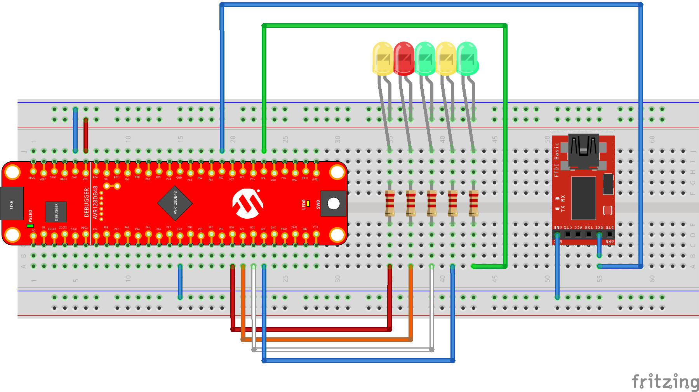

AVR128DB48 Curiosity Nano QPC port
==================================

[QuantumLeaps/qpc](https://github.com/QuantumLeaps/qp-arduino ) port for
[AVR128DB48 CURIOSITY NANO EVALUATION KIT](https://www.microchip.com/en-us/development-tool/EV35L43A) (Part Number: EV35L43A)

Now avr not supported by the [QuantumLeaps](https://www.state-machine.com/).
This is a custom port of the QV kernel for AVR128. 

QPC compiled as static library.

BSP
---

Boards have different pin configuration. Direct move not available.

| pin          | AVR128DA48  | AVR128DB48  |
|--------------|-------------|-------------|
| Yellow LED0  | PC6         | PB3         | 
| User switch (SW0)  | PC7   | PB2         | 
| UART         | USART1      | USART3      | 
| UART RX      | PC0         | PB0         | 
| UART TX      | PC1         | PB1         |

blinker
-------

Simple blinker with logging to the VCP port.

```bash
QPN version:
Program Memory Usage 	:	3752 bytes   2,9 % Full
Data Memory Usage 		:	194 bytes   1,2 % Full

QPC version:
Program Memory Usage 	:	4258 bytes   3,2 % Full
Data Memory Usage 		:	368 bytes   2,2 % Full
```

dpp
---



Philo out leds PC0-PC4, Spy output UART4 PE0, PE1

Spy configuration
-----------------

Binary flow from Spy break the debugger.
Has simultaneous errors when working from internal clock! Need external quartz.

[qspy.exe params, dependent by *_port.h](https://www.state-machine.com/qtools/qspy.html#qspy_about)

* T 4 - time stamp size (default value)
* O 2 - object pointer size
* F 2 - function pointer size
* S 1 - signal size
* E 1 - event size 
* Q 1 - queue counter size
* P 1 - pool counter size
* B 1 - block size
* C 2 - time event counter size (default value)

```bash
qspy -c COM4 -b 19200 -T 4 -O 2 -F 2 -S 1 -E 1 -Q 1 -P 1 -B 1 -C 2
```
```bash
Debug config:
Program Memory Usage 	:	7318 bytes   5,6 % Full
Data Memory Usage 		:	659 bytes   4,0 % Full

Spy config:
Program Memory Usage 	:	19536 bytes   14,9 % Full
Data Memory Usage 		:	3344 bytes   20,4 % Full
```

  
